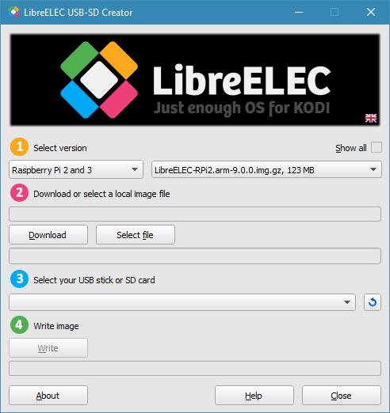

{: .image-left } To create bootable USB or SD Card installation media for any LibreELEC supported platform please download the "LibreELEC USB-SD Creator" app and run it with administrator rights.

<ul class="icons alt">
<li><a href="http://releases.libreelec.tv/LibreELEC.USB-SD.Creator.Win32.exe" class="icon alt fa-windows" target="_blank">Windows Windows</a></li>
<li><a href="http://releases.libreelec.tv/LibreELEC.USB-SD.Creator.macOS.dmg" class="icon alt fa-apple" target="_blank">MacOS MacOS</a></li>
</ul>
<ul class="icons alt">
<li><a href="http://releases.libreelec.tv/LibreELEC.USB-SD.Creator.Linux-32bit.bin" class="icon alt fa-linux" target="_blank">Linux 32Bit Linux 32Bit</a></li>
<li><a href="http://releases.libreelec.tv/LibreELEC.USB-SD.Creator.Linux-64bit.bin" class="icon alt fa-linux" target="_blank">Linux 64Bit Linux 64Bit</a></li>
</ul>

