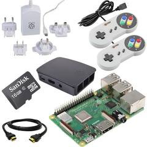
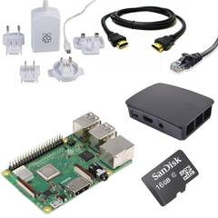
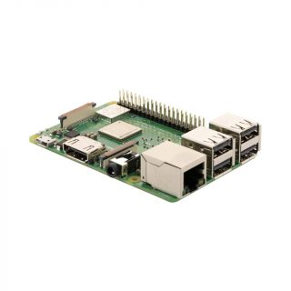
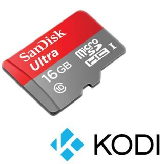
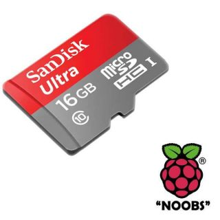

Purchasing a [LibreELEC tee-shirt](https://teespring.com/en-GB/libreelec?tsmac=store&tsmic=libreelec#pid=373&cid=100035&sid=front) or [hoodie](https://teespring.com/en-GB/libreelec?tsmac=store&tsmic=libreelec#pid=377&cid=100063&sid=front) allows you to support us (all profits go to the project) and look great at the same time. Whether you need to [stand out in a crowd](https://kodi.tv/kodi-devcon-2016-live-blog/) or impress small children, the LibreELEC apparel store has you covered!  

 

We are using teespring.com to handle money and logistics. This is the same company Kodi use for their shirts so we know the merchandise is good quality and the service reliable. The LibreELEC store is organised to make a print run every four days  and we receive a fixed amount back per-item ordered.

**RASPBERRY PI KITS**

If you are thinking about upgrading an older Raspberry Pi to the latest model or want to build a new Kodi or retro-gaming kit, or simply need to get a new SD card (with noobs/LibreELEC pre-installed) - please use the links below and The Pi Hut donates a percentage of the sale back to the project.

||||
|--|:--:|:--:|
|[Model 3B+ Mediacenter Kit](https://thepihut.com/collections/raspberry-pi-kits-and-bundles/products/raspberry-pi-3b-plus-media-centre-kit)|[Model 3B+ Retro Gaming Kit](https://thepihut.com/collections/raspberry-pi-kits-and-bundles/products/raspberry-pi-3b-plus-retro-gaming-bundle)|[Model 3B+ Starter Kit](https://thepihut.com/collections/raspberry-pi-kits-and-bundles/products/raspberry-pi-3b-plus-starter-kit)|
||||
|[Model 3B+ Single Board](https://thepihut.com/collections/raspberry-pi/products/raspberry-pi-3-model-b-plus)|[16GB SanDisk LE SD Card](https://thepihut.com/collections/raspberry-pi-sd-cards-and-adapters/products/kodi-preinstalled-sd-card)|[16GB SanDisk NOOBS SD Card](https://thepihut.com/collections/raspberry-pi-sd-cards-and-adapters/products/noobs-preinstalled-sd-card)|